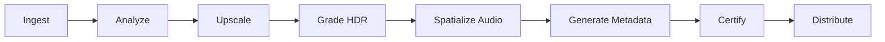

<div align="center">


### Content Mastering

**Ingest · Transcode · Certify · Distribute**

<br/>

[](https://github.com/sylvain-cinema/content-pipeline/actions/workflows/ci.yml)
[](LICENSE)
[](https://python.org)

<br/>

*Transform any film into a Sylvain Certified immersive experience.*
*16K upscaling · HDR grading · WFS audio spatialization · Multi-tier packaging.*

</div>

<br/>

---

<br/>

## Pipeline



<br/>

## Output Formats

| Tier | Resolution | HDR | Audio |
|:-----|:-----------|:----|:------|
| **SANCTUM** | 16K | PQ 10,000 nits | Sonora Elite |
| **VISIONNAIRE** | 16K × 16K | PQ 10,000 nits | Sonora WFS |
| **ÉTOILÉE** | 8K | PQ 4,000 nits | Sonora WFS |
| **ATELIER** | Variable | PQ / HLG | Sentio Suite |

<br/>

## Quick Start

```bash
pip install sylvain-pipeline

sylvain-pipeline master input.mov --tier visionnaire
sylvain-pipeline certify ./mastered/ --tier visionnaire
```

<br/>

## License

Licensed under the [Apache License, Version 2.0](LICENSE).

<br/>

---

<div align="center">
<br/>


<sub>Every Seat is the Best Seat</sub>

</div>
