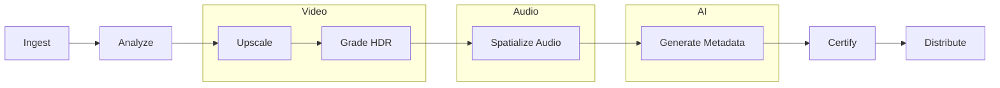

<](https://github.com/sylvain-cinema/content-pipeline/actions)
[](https://python.org)
[](LICENSE)

*Transform any film into a Sylvain Certified immersive experience.*

</div>

---

## Overview

The Content Pipeline handles end-to-end mastering for Sylvain cinema format: 16K upscaling, HDR grading automation, WFS audio spatialization (Dolby Atmos → Sonora WFS), SENTIO emotional metadata generation, and multi-tier packaging for all venue formats.

## Pipeline



## Output Formats

| Tier | Resolution | HDR | Audio | Notes |
|------|-----------|-----|-------|-------|
| SANCTUM | 16K | PQ 10,000 nits | Sonora Elite | Bespoke mastering |
| VISIONNAIRE | 16K × 16K | PQ 10,000 nits | Sonora WFS | Reference quality |
| ÉTOILÉE | 8K | PQ 4,000 nits | Sonora WFS | Mass premium |
| ATELIER | Variable | PQ/HLG | Sentio Suite | Adaptive |

## Quick Start

```bash
pip install sylvain-pipeline

# Full pipeline
sylvain-pipeline master input.mov --tier visionnaire

# Individual stages
sylvain-pipeline ingest input.mov
sylvain-pipeline upscale --target 16k
sylvain-pipeline spatialize --from atmos --to wfs
sylvain-pipeline certify --tier visionnaire
```

## License

Apache License 2.0.
]]>